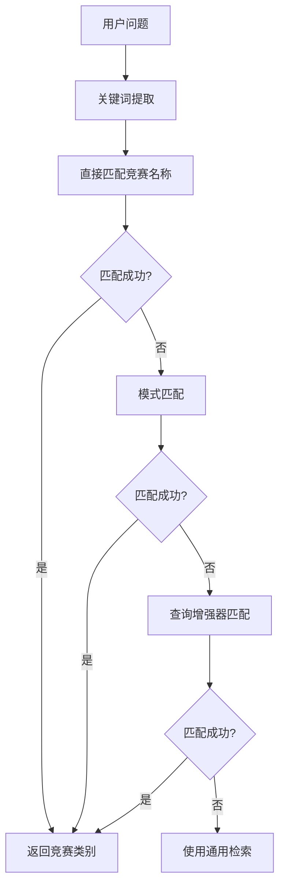
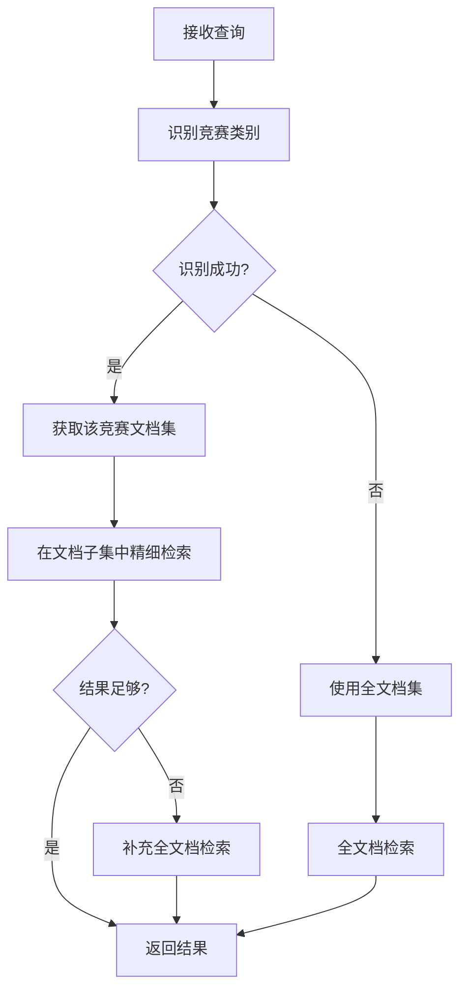

# 📚 文档层级检索（Hierarchical Retrieval）功能

## 🎯 功能概述

文档层级检索是一个智能检索增强功能，通过先定位竞赛类别，再进行精细检索的方式显著提高文档检索的准确性。该功能特别适用于泰迪杯竞赛智能客服场景，能够精准识别用户问题所属的竞赛类别，并在相应的文档范围内进行检索。

## 🔧 核心特性

### 1. 智能竞赛识别
- **自动分类**: 根据问题内容自动识别所属竞赛类别
- **关键词匹配**: 基于竞赛名称和关键词进行精准匹配
- **多级匹配**: 支持直接匹配、模式匹配和语义匹配

### 2. 层级检索策略
- **特定竞赛检索**: 针对特定竞赛问题，只在相关文档中检索
- **通用检索**: 对于通用问题，在全文档库中检索
- **混合策略**: 当特定检索结果不足时，自动补充通用检索

### 3. 智能降级机制
- **结果不足补充**: 当特定竞赛检索结果不足时，自动补充全文档检索
- **错误恢复**: 当层级检索失败时，自动降级到基础检索
- **配置可控**: 通过配置文件灵活控制检索策略

## 📁 文件结构

```
src/
├── hierarchical_retriever.py      # 层级检索器核心实现
├── langchain_rag.py              # RAG系统集成
└── query_enhancer.py             # 查询增强器（竞赛映射）

config.py                         # 配置文件
test_hierarchical_retrieval.py    # 功能测试脚本
demo_hierarchical_retrieval.py    # 功能演示脚本
```

## 🚀 快速开始

### 1. 配置启用

在 `config.py` 中启用层级检索：

```python
RETRIEVAL_CONFIG = {
    # 层级检索配置
    "enable_hierarchical": True,  # 启用层级检索
    "hierarchical_similarity_threshold": 0.7,
    "hierarchical_fallback": True,
    
    # 其他配置...
}
```

### 2. 基本使用

```python
from src.langchain_rag import LangChainRAGSystem

# 初始化RAG系统（自动启用层级检索）
rag_system = LangChainRAGSystem()

# 加载文档
rag_system.load_documents(directory_path="./data")

# 使用层级检索回答问题
response = rag_system.answer_question("3D编程模型竞赛的报名时间是什么时候？")
print(response.answer)
```

### 3. 直接使用层级检索器

```python
from src.hierarchical_retriever import create_hierarchical_retriever
from src.langchain_retriever import LangChainHybridRetriever
from src.langchain_vectorstore import LangChainVectorStore

# 创建基础组件
vectorstore = LangChainVectorStore()
base_retriever = LangChainHybridRetriever(vectorstore, documents)

# 创建层级检索器
hierarchical_retriever = create_hierarchical_retriever(
    base_retriever=base_retriever,
    docs=documents
)

# 检索文档
docs = hierarchical_retriever.retrieve("人工智能竞赛的奖项设置如何？")
```

## 🧪 测试和演示

### 1. 运行功能测试

```bash
python test_hierarchical_retrieval.py
```

测试内容包括：
- 竞赛识别准确性测试
- 检索性能对比测试
- 层级检索 vs 通用检索对比
- 问答功能测试

### 2. 运行演示程序

```bash
python demo_hierarchical_retrieval.py
```

演示内容包括：
- 实时竞赛识别展示
- 检索结果分析
- 问答功能演示

## 📊 支持的竞赛类别

层级检索器当前支持以下竞赛类别：

| 竞赛类别 | 关键词 | 示例问题 |
|---------|--------|----------|
| 3D编程 | 3D, 编程模型, 三维编程 | "3D编程模型竞赛的报名时间？" |
| 机器人工程 | 机器人工程, 机器人设计 | "机器人工程设计专项赛的要求？" |
| 人工智能 | 人工智能, AI, 机器学习 | "人工智能竞赛的奖项设置？" |
| 智能芯片 | 智能芯片, 芯片, 计算思维 | "智能芯片设计竞赛的作品要求？" |
| 无人驾驶 | 无人驾驶, 自动驾驶, 智能车 | "无人驾驶智能车专项赛的参赛对象？" |
| 虚拟仿真 | 虚拟仿真, 仿真平台 | "虚拟仿真平台设计竞赛的技术要求？" |
| 智慧城市 | 智慧城市, 城市设计 | "智慧城市竞赛的比赛时间？" |
| 生成式AI | 生成式, AIGC, 生成模型 | "生成式AI应用专项赛的评分标准？" |
| 太空探索 | 太空探索, 太空机器人 | "太空探索机器人竞赛的技术规范？" |
| 开源鸿蒙 | 鸿蒙, 开源, HarmonyOS | "开源鸿蒙机器人专项赛的开发平台？" |

## 🔍 工作原理

### 1. 竞赛识别流程



### 2. 检索流程



## ⚙️ 配置选项

### 核心配置

```python
RETRIEVAL_CONFIG = {
    # 层级检索配置
    "enable_hierarchical": True,               # 是否启用层级检索
    "hierarchical_similarity_threshold": 0.7,  # 竞赛匹配相似度阈值
    "hierarchical_fallback": True,             # 是否启用降级机制
}
```

### 高级配置

```python
# 在HierarchicalRetriever初始化时配置
hierarchical_retriever = HierarchicalRetriever(
    base_retriever=base_retriever,
    docs=documents,
    similarity_threshold=0.7,      # 竞赛匹配阈值
    enable_general_fallback=True   # 启用通用检索降级
)
```

## 📈 性能优势

### 1. 准确性提升
- **精准定位**: 通过竞赛分类，大幅减少无关文档干扰
- **相关性增强**: 在特定竞赛文档中检索，相关性明显提高
- **噪音降低**: 避免跨竞赛类别的错误匹配

### 2. 效率优化
- **搜索空间缩小**: 只在相关文档子集中检索，提高检索速度
- **计算资源节省**: 减少不必要的相似度计算
- **结果质量提升**: 更高的信噪比

### 3. 用户体验改善
- **回答精准度**: 针对性更强的文档检索，答案更准确
- **响应速度**: 优化的检索范围，响应更快
- **覆盖全面**: 通用问题仍能获得全面的答案

## 🔧 调试和诊断

### 1. 问题分析

```python
# 获取层级检索器
hierarchical_retriever = rag_system.retriever.hierarchical_retriever

# 分析问题识别结果
analysis = hierarchical_retriever.debug_question_analysis("你的问题")
print(f"识别的竞赛: {analysis['identified_competition']}")
print(f"匹配分数: {analysis['competition_scores']}")
```

### 2. 竞赛统计

```python
# 获取竞赛文档统计
stats = hierarchical_retriever.get_competition_stats()
for comp_name, doc_count in stats.items():
    print(f"{comp_name}: {doc_count} 个文档")
```

### 3. 检索对比

```python
# 对比层级检索和通用检索
question = "3D编程模型竞赛的要求？"

# 层级检索
hierarchical_docs = hierarchical_retriever.retrieve(question)

# 通用检索  
general_docs = hierarchical_retriever.general_retrieval(question)

print(f"层级检索: {len(hierarchical_docs)} 个文档")
print(f"通用检索: {len(general_docs)} 个文档")
```

## 🚨 注意事项

### 1. 适用场景
- ✅ **适合**: 针对特定竞赛的明确问题
- ✅ **适合**: 多竞赛类别的文档库
- ❌ **不适合**: 单一类别文档库
- ❌ **不适合**: 高度抽象的通用问题

### 2. 配置建议
- 对于问题识别准确率要求高的场景，可以提高 `similarity_threshold`
- 对于覆盖面要求高的场景，建议启用 `enable_general_fallback`
- 可以根据实际数据调整竞赛关键词映射

### 3. 性能考虑
- 层级检索会增加问题分析的计算开销
- 建议在文档数量较大（>1000个）时使用
- 可以通过配置控制是否启用该功能

## 🤝 扩展和定制

### 1. 添加新竞赛类别

在 `hierarchical_retriever.py` 中添加新的竞赛模式：

```python
self.competition_patterns = {
    "新竞赛名称": ["关键词1", "关键词2", "关键词3"],
    # ... 其他竞赛
}
```

### 2. 自定义识别逻辑

继承 `HierarchicalRetriever` 类，重写 `identify_competition` 方法：

```python
class CustomHierarchicalRetriever(HierarchicalRetriever):
    def identify_competition(self, question: str, available_competitions: List[str]) -> Optional[str]:
        # 实现自定义识别逻辑
        return super().identify_competition(question, available_competitions)
```

### 3. 集成其他检索器

层级检索器可以与其他检索增强功能组合使用：

```python
# 层级检索 + 多样性检索
RETRIEVAL_CONFIG = {
    "enable_hierarchical": True,
    "enable_diversity": True,
    # ... 其他配置
}
```

## 📞 支持和反馈

如有问题或建议，请：

1. 查看测试结果 JSON 文件中的详细信息
2. 运行调试分析功能获取更多细节
3. 检查日志输出中的警告和错误信息
4. 根据实际使用场景调整配置参数

---

> 📝 **提示**: 层级检索功能是智能客服系统的重要增强特性，合理配置和使用可以显著提升检索准确性和用户体验。 